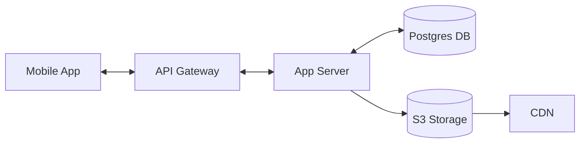

# Fishing Tracker App --- Product & Technical Spec (v0.3)

**Date:** 2025‑09‑05\
**Platforms:** iOS & Android (single codebase)\
**Author:** ChatGPT (for Will)\
**Audience:** Product, Engineering, QA, Design

------------------------------------------------------------------------

## 1) Summary

A mobile app for anglers to **record fishing sessions offline** and
**sync when a connection is available**. While a session is active, the
app captures a **GPS fix every 5 minutes**, lets users **take photos**
tied to location/time, and log **catches**. Data persists locally first
and syncs to a backend when online.

------------------------------------------------------------------------

## 2) Goals / Non‑Goals

**Goals** - Start/stop fishing sessions - GPS breadcrumb capture every 5
min - Offline-first local storage - Sync when online - Simple,
transparent UX

**Non‑Goals (MVP)** - Social features - Wearable integration - Advanced
analytics - Map tile caching (future)

------------------------------------------------------------------------

## 3) Personas & Use Cases

-   **Solo Angler**: track remote trips offline, sync later
-   **Guide**: track multiple daily sessions

Use Cases: 1. Offline session + sync later 2. Background tracking while
multitasking 3. Review past sessions with tracks, photos, catches

------------------------------------------------------------------------

## 4) Requirements (Client-Side)

-   Session lifecycle (start/stop)
-   Location sampling every 5 min
-   Photos with lat/lon + timestamp
-   Catch entries (species, length, optional weight/notes)
-   Offline-first local DB
-   Background sync with retries
-   History view of sessions

------------------------------------------------------------------------

## 5) Backend Architecture

### 5.1 API Endpoints

-   `POST /auth/register` → create new user (with email verification)\
-   `POST /auth/login` → JWT + refresh token\
-   `POST /auth/refresh` → new token\
-   `POST /auth/password-reset` → request reset email\
-   `POST /sync/up` → upload deltas (sessions, track_points, catches,
    photo metadata)\
-   `POST /sync/down` → fetch server deltas since timestamp\
-   `POST /photos/presigned-url` → presigned S3 URL for direct photo
    upload

### 5.2 Example API Documentation

**/sync/up Request**

``` json
{
  "last_sync_timestamp": "2025-09-05T09:00:00Z",
  "sessions": [{ "id": "uuid", "started_at": "...", "ended_at": "..." }],
  "track_points": [{ "session_id": "uuid", "ts": 1736123456789, "lat": 34.1, "lon": -119.1 }],
  "catches": [{ "session_id": "uuid", "species": "Bass", "length": 24.5 }],
  "photos_meta": [{ "id": "uuid", "session_id": "uuid", "ts": 1736123456789, "s3_key": "photos/uuid.jpg" }]
}
```

**/sync/up Response**

``` json
{
  "status": "success",
  "synced_count": 42,
  "conflicts": [],
  "server_timestamp": "2025-09-05T10:00:00Z"
}
```

### 5.3 Database Schema (Postgres)

**users**(id, email, password_hash, created_at)\
**sessions**(id, user_id, started_at, ended_at, title, notes)\
**track_points**(id, session_id, ts, lat, lon, acc, speed, heading)\
**photos**(id, session_id, ts, lat, lon, uri, s3_key, size)\
**catches**(id, session_id, ts, species, length, weight, notes, lat,
lon)

### 5.4 Infrastructure

-   **API Layer**: FastAPI (Python) - stateless, containerized\
-   **DB Layer**: Postgres with PITR backups\
-   **Storage**: S3 for photos, encrypted at rest\
-   **CDN**: CloudFront\
-   **Auth**: JWT + refresh tokens

### 5.5 Rate Limiting

-   API requests: 100/min per user\
-   Sync batch: max 500 items or 10MB payload\
-   Photo upload: max 5MB per photo after compression\
-   Retries: exponential backoff, max 5 retries

### 5.6 Backup & Recovery

-   Daily DB snapshots (30-day retention)\
-   S3 versioning enabled\
-   Cold standby region

------------------------------------------------------------------------

## 6) Technical Implementation

### 6.1 Mobile Framework

Decision: **React Native bare** (background services, ecosystem support)

### 6.2 Architecture Diagram (Mermaid)



### 6.3 Data Flow (Sync)

1.  Offline data stored in SQLite\
2.  On connectivity, batch queued to `/sync/up`\
3.  Server applies deltas, responds with conflicts + server timestamp\
4.  Client merges and applies `/sync/down` updates

### 6.4 Security Model

-   TLS 1.2+\
-   JWT (1h expiry) + refresh tokens\
-   AES-256 at rest (DB, S3)\
-   Row-level ownership enforced by `user_id`\
-   Secure device storage for tokens

### 6.5 Performance Targets

-   Sync \<2s for 100 track points\
-   API p95 \<500ms\
-   Battery \<5% per 8h\
-   App size \<50MB

------------------------------------------------------------------------

## 7) Data Management

### 7.1 Local DB Schema (SQLite)

``` sql
CREATE TABLE sync_queue (
  id INTEGER PRIMARY KEY,
  entity_type TEXT,
  entity_id TEXT,
  operation TEXT,
  retry_count INTEGER,
  created_at TIMESTAMP
);
```

Other tables mirror server schema: `sessions`, `track_points`, `photos`,
`catches`

### 7.2 Sync State Machine

Idle → Queueing → Uploading → Conflict → Resolved → Synced

### 7.3 Conflict Resolution

-   Last Write Wins by `last_modified_at`\
-   Tombstones beat updates\
-   Photos unique by ID

### 7.4 Data Retention

-   Local DB cap 200MB\
-   Photo cache 1GB\
-   Server retains until user deletes

### 7.5 Migration

-   Server: Flyway/Prisma\
-   Mobile: SQLite migrations per version

------------------------------------------------------------------------

## 8) Non-Functional Requirements

### 8.1 Error Handling Codes

-   4001: Invalid sync token\
-   4002: Conflict requires resolution\
-   4003: Photo too large\
-   5001: Database unavailable

### 8.2 Storage & Bandwidth

-   Photos compressed to \<5MB\
-   Gzip JSON sync\
-   WAL journaling enabled

### 8.3 GPS Permission Fallbacks

-   If denied mid-session → stop tracking gracefully\
-   Manual session entry allowed (no GPS)

### 8.4 Offline Map Strategy

-   Breadcrumbs shown on basic offline tiles (MapBox offline)\
-   Map optional in MVP

### 8.5 Monitoring

-   Client: Crashlytics/Sentry\
-   Server: Prometheus, Grafana

------------------------------------------------------------------------

## 9) Testing Strategy

-   Offline trip simulation → sync later\
-   Background GPS test (8h screen off)\
-   Sync failure recovery tests\
-   Multi-device conflict resolution\
-   Platform-specific edge cases (iOS background kill, Android Doze)

------------------------------------------------------------------------

## 10) Privacy & Compliance

-   Opt-in location permissions\
-   Export + delete account options\
-   GDPR/CCPA compliant\
-   No third-party data sale

------------------------------------------------------------------------

## 11) Acceptance Criteria

-   GPS points every 5 min during active session\
-   Photos + catches linked correctly\
-   Sync works offline-first, conflict-free\
-   Auth flows secure (register, login, refresh, reset)\
-   Background tracking stable

------------------------------------------------------------------------

**End of Spec v0.3**
